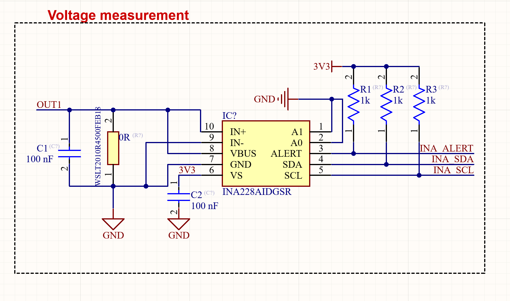

# Recruitment Assignment: INA228 Bus Voltage Acquisition on STM32

## Overview

This assignment builds upon a previously initiated project and centers on interfacing an STM32 microcontroller with the Texas Instruments INA228 current/voltage/power monitor. Using the [INA228 datasheet](https://www.ti.com/lit/ds/symlink/ina228.pdf) as a reference as well as the reported schematics, please address the following requirements:

### 1. STM32-INA228 I2C Setup

- Implement the `setup` function to configure the STM32 microcontroller for I2C communication with the INA228.
- The expected bus voltage range for this assignment is 0 to 10 V. Measurement and monitoring of current and power are not required at this stage; the focus should remain solely on accurate voltage acquisition.
- For any unspecified parameters, select reasonable and justified default values.

### 2. Bus Voltage Retrieval

- Develop a function to read the BUSVOLTAGE register from the INA228 device via I2C.
- The variable on wich the voltage should be saved is passed by reference

> **Note:**  
> I2C communication should utilize the `HAL_I2C_Mem_Write` and `HAL_I2C_Mem_Read` functions as described in the provided `lib.h` file.
> Certain parameters required for a correct implementation should be referenced and derived from the INA228 datasheet to ensure accuracy and compliance with device specifications.

---

## Optional Task

**Continuous Bus Voltage Monitoring**

- Extend your implementation to periodically read and log the bus voltage from the INA228 at a configurable interval (for example, in a sample `main.c` file).
- Implement an alert mechanism (such as toggling an LED or sending a message) if the bus voltage exceeds 15 V or falls below 3 V, but only after three consecutive readings outside this range.
- Log voltage readings using a circular queue implemented as a first-class ADT, with the queue defined in `queue.h` and `queue.c`.

Comprehensive documentation of your implementation is highly encouraged, though not mandatory.

---

_Note: The submitted code will not be executed, but may be discussed during the interview process if you are selected for the next stage._
